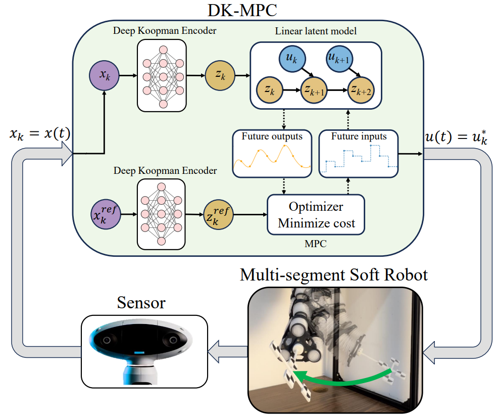
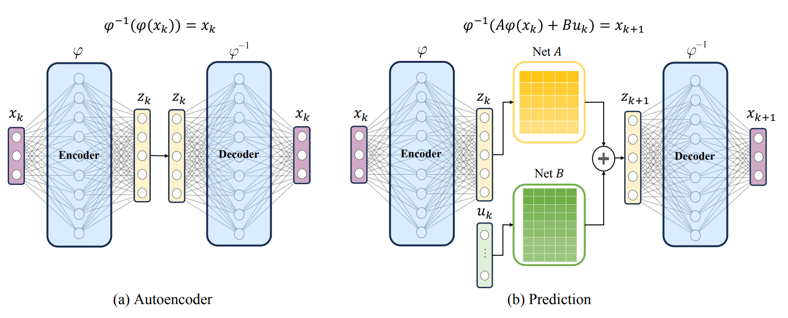
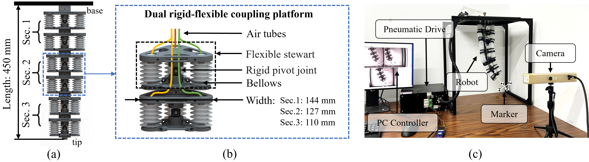
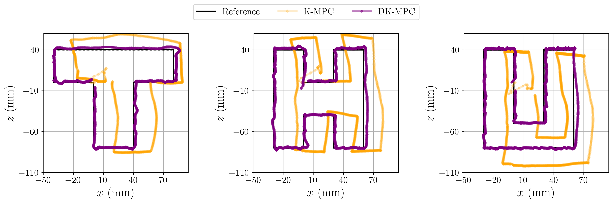

# Multi-segment Soft Robot Control via  
**Deep Koopman-based Model Predictive Control (DK-MPC)**

**Authors:**  
Lei Lv1,2, Lei Liu2,3, Lei Bao3,4, Fuchun Sun2, Jiahong Dong5, Jianwei Zhang6, Xuemei Shan4, Kai Sun2,3, Hao Huang7, Yu Luo2

**Affiliations:**  
1 Shanghai Research Institute for Intelligent Autonomous Systems, Tongji University  
2 Department of Computer Science and Technology, Tsinghua University  
3 School of Biomedical Engineering, Tsinghua University  
4 Beijing Soft Robot Tech Co., Ltd  
5 School of Clinical Medicine, Tsinghua University  
6 Department of Informatics, University of Hamburg  
7 School of Mechanical Engineering and Automation, Beihang University

---

## Abstract

Soft robots, compared to regular rigid robots, as their multiple segments with soft materials bring flexibility and compliance, have the advantages of safe interaction and dexterous operation in the environment. However, due to its characteristics of high dimensional, nonlinearity, time-varying nature, and infinite degree of freedom, it has been challenges in achieving precise and dynamic control such as trajectory tracking and position reaching. To address these challenges, we propose a framework of Deep Koopman-based Model Predictive Control (DK-MPC) for handling multi-segment soft robots. We first employ a deep learning approach with sampling data to approximate the Koopman operator, which therefore linearizes the high-dimensional nonlinear dynamics of the soft robots into a finite-dimensional linear representation. Secondly, this linearized model is utilized within a model predictive control framework to compute optimal control inputs that minimize the tracking error between the desired and actual state trajectories. The real-world experiments on the soft robot “Chordata” demonstrate that DK-MPC could achieve high-precision control, showing the potential of DK-MPC for future applications to soft robots.

---

## The proposed DK-MPC architecture

  
*DK-MPC architecture.*

---

## Framework for Learning Koopman Operators

---

## Design of soft robot “Chordata”

---

## Experiments on soft robot “Chordata”

### Moving target tracking (1×)

<video src="Videos/trackingfront.mp4" controls loop muted width="720">
  Your browser does not support the video tag.
</video>  
[Download video](Videos/trackingfront.mp4)

---

### Path tracking (10×)

> For accurate video alignment, please refresh the page prior to playback.

<table>
  <tr>
    <td align="center">
      <video src="Videos/t2.mp4" controls loop muted width="320"></video> 
      t2 
      <a href="Videos/t2.mp4">Download</a>
    </td>
    <td align="center">
      <video src="Videos/h2.mp4" controls loop muted width="320"></video> 
      h2 
      <a href="Videos/h2.mp4">Download</a>
    </td>
    <td align="center">
      <video src="Videos/u2.mp4" controls loop muted width="320"></video> 
      u2 
      <a href="Videos/u2.mp4">Download</a>
    </td>
    <td align="center">
      <video src="Videos/o2.mp4" controls loop muted width="320"></video> 
      o2 
      <a href="Videos/o2.mp4">Download</a>
    </td>
  </tr>
</table>

<table>
  <tr>
    <td align="center">
      <video src="Videos/t2fig.mp4" controls loop muted width="320"></video> 
      t2 (fig) 
      <a href="Videos/t2fig.mp4">Download</a>
    </td>
    <td align="center">
      <video src="Videos/h2fig.mp4" controls loop muted width="320"></video> 
      h2 (fig) 
      <a href="Videos/h2fig.mp4">Download</a>
    </td>
    <td align="center">
      <video src="Videos/u2fig.mp4" controls loop muted width="320"></video> 
      u2 (fig) 
      <a href="Videos/u2fig.mp4">Download</a>
    </td>
    <td align="center">
      <video src="Videos/o2fig.mp4" controls loop muted width="320"></video> 
      o2 (fig) 
      <a href="Videos/o2fig.mp4">Download</a>
    </td>
  </tr>
</table>

---

### Path tracking (figure)

---

### Moving target tracking (figure)

---

## Video (full)

<video src="Videos/video.mp4" controls loop muted width="1000">
  Your browser does not support the video tag.
</video>  
[Download video](Videos/video.mp4)

---

<a href="#top">Back to top ↑</a>

